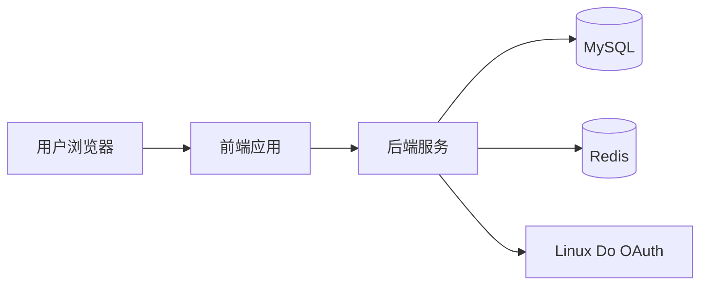
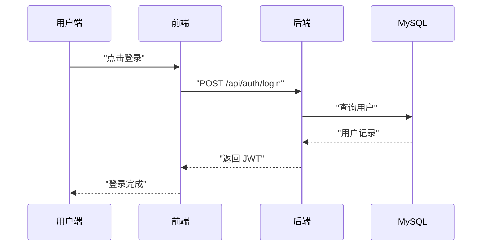

# 架构设计

## 概述

爱国红色答题与集卡奖励系统是一个前后端分离的教育互动平台，核心目标是将红色文化知识学习转化为可持续参与的活动体验。用户通过答题、签到、分享、阅读故事等行为获取积分与卡片，最终完成奖励兑换。

系统以 Web 形式交付，前端负责交互体验、路由与状态管理，后端负责业务逻辑、权限认证、数据持久化与统计计算。后端统一以 `/api` 作为接口前缀，前端通过 Vite 代理将请求转发至后端。

在认证层面，系统支持账号密码与 Linux Do OAuth 两种登录方式。所有需要用户身份的接口均通过 JWT 进行授权校验，管理端接口在此基础上增加管理员权限校验。

数据层使用 Sequelize ORM 对接 MySQL，提供用户、题目、答题记录、卡组、卡片、签到、邀请、故事与兑换等核心实体。项目提供数据库迁移与初始化脚本，便于快速落地运行。

## 技术栈

**语言与运行时**
- Node.js 18
- JavaScript ES Modules

**前端**
- Vue 3
- Vite
- Vue Router
- Pinia
- Element Plus

**后端**
- Express
- Sequelize
- JWT
- Joi

**数据存储**
- MySQL 8
- SQLite 作为替代开发存储
- Redis 配置预留但当前未启用

**外部服务**
- Linux Do OAuth

## 项目结构

```
.
├── backend/                 # 后端服务
│   ├── src/
│   │   ├── config/          # 数据库与缓存配置
│   │   ├── controllers/     # 业务控制器
│   │   ├── middlewares/     # 认证与限流中间件
│   │   ├── models/          # Sequelize 数据模型
│   │   ├── routes/          # API 路由
│   │   ├── scripts/         # 迁移与初始化脚本
│   │   ├── services/        # 服务层
│   │   └── utils/           # 通用工具
│   └── package.json
├── frontend/                # 前端应用
│   ├── src/
│   │   ├── api/             # API 调用封装
│   │   ├── components/      # 组件
│   │   ├── router/          # 路由
│   │   ├── stores/          # Pinia 状态
│   │   ├── utils/           # 工具与请求封装
│   │   └── views/           # 页面
│   └── package.json
├── start.sh                 # 一键启动脚本
└── DEPLOYMENT.md            # 现有部署说明
```

**入口点**
- `backend/src/index.js` - 后端服务启动入口
- `frontend/src/main.js` - 前端应用入口

## 子系统

### 前端应用
**目的**: 提供答题、签到、集卡与兑换的用户交互体验
**位置**: `frontend/src/`
**关键文件**: `frontend/src/router/index.js`, `frontend/src/stores/user.js`, `frontend/src/utils/request.js`
**依赖**: 后端 API, Element Plus, Pinia
**被依赖**: 无

### 后端 API
**目的**: 提供业务接口与数据访问能力
**位置**: `backend/src/`
**关键文件**: `backend/src/index.js`, `backend/src/routes/index.js`, `backend/src/controllers/*`
**依赖**: MySQL, JWT, Linux Do OAuth
**被依赖**: 前端应用

### 认证与权限
**目的**: 用户登录与权限控制
**位置**: `backend/src/middlewares/auth.js`, `backend/src/utils/jwt.js`
**关键文件**: `backend/src/routes/auth.js`, `backend/src/routes/linuxdo.js`
**依赖**: JWT, Linux Do OAuth
**被依赖**: 所有需要鉴权的接口

### 数据层
**目的**: 持久化用户、题目、卡组、奖励等核心数据
**位置**: `backend/src/models/`
**关键文件**: `backend/src/models/index.js`, `backend/src/models/User.js`
**依赖**: Sequelize, MySQL
**被依赖**: 控制器与脚本

### 运营管理
**目的**: 管理题库、卡组与统计数据
**位置**: `backend/src/routes/admin.js`, `backend/src/controllers/adminController.js`
**关键文件**: `backend/src/controllers/adminController.js`
**依赖**: 认证中间件, 数据层
**被依赖**: 管理端页面

## 架构图



## 关键流程



## 设计决策

- 使用 Vite 代理 `/api`，本地开发减少跨域配置成本
- 认证采用 JWT，便于前后端分离和接口统一鉴权
- Sequelize 作为 ORM 兼顾 MySQL 与 SQLite 的灵活配置
- 管理端 API 统一通过中间件进行管理员权限控制
