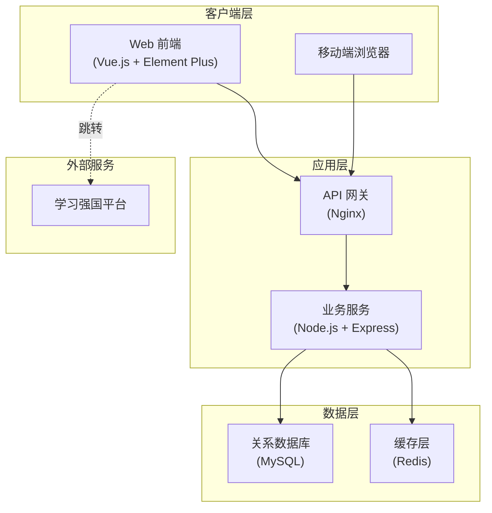
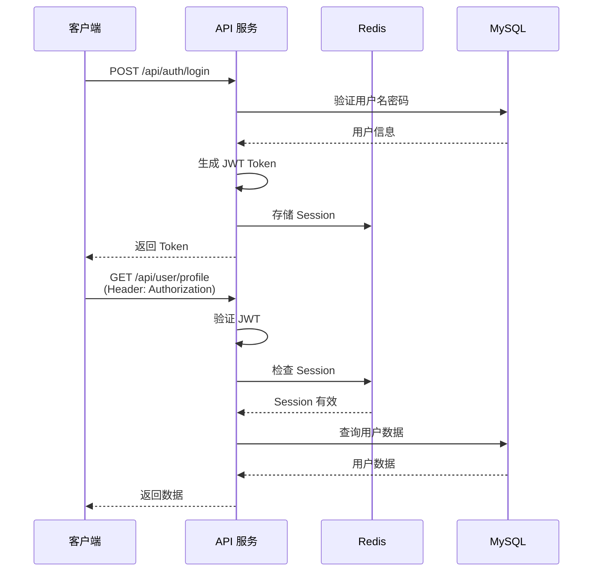
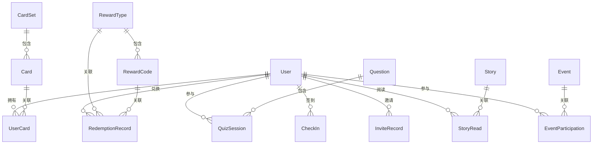

# 爱国红色答题与集卡奖励系统 - 技术设计文档

Feature Name: patriotic-quiz-rewards
Updated: 2026-02-09

## 描述

本系统是一个基于 Web 的爱国主义教育互动平台，采用前后端分离架构，通过答题、签到、分享、阅读红色故事等多种方式激励用户学习红色文化知识，并提供第三方兑换码作为福利奖励。系统支持管理员批量导入福利码、管理题库和创建特殊活动。

## 架构设计

### 系统架构图



### 技术栈

**前端:**
- Vue.js 3.x - 渐进式 JavaScript 框架
- Vue Router - 路由管理
- Pinia - 状态管理
- Element Plus - UI 组件库
- Axios - HTTP 客户端
- Vite - 构建工具

**后端:**
- Node.js 18+ - 运行时环境
- Express.js - Web 框架
- Sequelize - ORM 框架
- JWT - 身份认证
- bcrypt - 密码加密
- express-rate-limit - 接口频率限制

**数据库:**
- MySQL 8.0 - 主数据库
- Redis 7.0 - 缓存和会话存储

**部署:**
- Nginx - 反向代理和静态资源服务
- PM2 - Node.js 进程管理

## 组件和接口

### 核心模块

#### 1. 用户模块 (User Module)

**职责:** 处理用户注册、登录、认证和个人信息管理

**主要接口:**

| 接口 | 方法 | 路径 | 说明 |
|------|------|------|------|
| 用户注册 | POST | /api/auth/register | 创建新用户账号 |
| 用户登录 | POST | /api/auth/login | 验证凭证并返回 JWT |
| 获取用户信息 | GET | /api/user/profile | 获取当前用户详情 |
| 更新用户信息 | PUT | /api/user/profile | 更新用户资料 |
| 获取邀请码 | GET | /api/user/invite-code | 获取用户专属邀请码 |

**数据模型:**

```javascript
User {
  id: UUID,
  username: String(50),
  password: String(255), // bcrypt 加密
  phone: String(11),
  inviteCode: String(8), // 唯一邀请码
  invitedBy: UUID, // 邀请人 ID
  points: Integer, // 积分
  createdAt: DateTime,
  updatedAt: DateTime
}
```

#### 2. 答题模块 (Quiz Module)

**职责:** 管理题库、生成答题任务、评判答案

**主要接口:**

| 接口 | 方法 | 路径 | 说明 |
|------|------|------|------|
| 获取今日题目 | GET | /api/quiz/daily | 获取或生成今日答题任务 |
| 提交答案 | POST | /api/quiz/submit | 提交单题答案并返回结果 |
| 完成答题 | POST | /api/quiz/complete | 完成全部题目并结算奖励 |
| 获取答题历史 | GET | /api/quiz/history | 查询历史答题记录 |

**管理接口:**

| 接口 | 方法 | 路径 | 说明 |
|------|------|------|------|
| 创建题目 | POST | /api/admin/questions | 添加新题目 |
| 更新题目 | PUT | /api/admin/questions/:id | 修改题目内容 |
| 删除题目 | DELETE | /api/admin/questions/:id | 删除题目 |
| 查询题目列表 | GET | /api/admin/questions | 分页查询题目 |

**数据模型:**

```javascript
Question {
  id: UUID,
  content: Text, // 题目内容
  type: Enum('single', 'multiple', 'judge'), // 题目类型
  options: JSON, // 选项数组 [{key: 'A', value: '...'}]
  correctAnswer: String, // 正确答案 'A' 或 'AB' 或 'true'
  tags: JSON, // 知识点标签数组
  difficulty: Enum('easy', 'medium', 'hard'),
  createdAt: DateTime,
  updatedAt: DateTime
}

QuizSession {
  id: UUID,
  userId: UUID,
  date: Date, // 答题日期
  questions: JSON, // 题目 ID 数组
  answers: JSON, // 用户答案数组
  score: Integer, // 总分
  isPassed: Boolean, // 是否合格
  startedAt: DateTime,
  completedAt: DateTime
}
```

#### 3. 集卡模块 (Card Module)

**职责:** 管理卡片、卡组、发放和收集逻辑

**主要接口:**

| 接口 | 方法 | 路径 | 说明 |
|------|------|------|------|
| 获取卡册 | GET | /api/cards/collection | 获取用户拥有的卡片 |
| 获取卡组列表 | GET | /api/cards/sets | 获取所有卡组及收集进度 |
| 发放卡片 | POST | /api/cards/grant | 系统内部接口，发放卡片 |

**管理接口:**

| 接口 | 方法 | 路径 | 说明 |
|------|------|------|------|
| 创建卡组 | POST | /api/admin/card-sets | 创建新卡组 |
| 创建卡片 | POST | /api/admin/cards | 创建新卡片 |
| 更新卡片 | PUT | /api/admin/cards/:id | 修改卡片信息 |

**数据模型:**

```javascript
CardSet {
  id: UUID,
  name: String(100), // 卡组名称
  description: Text,
  theme: String(50), // 主题标签
  totalCards: Integer, // 卡组包含卡片数量
  createdAt: DateTime
}

Card {
  id: UUID,
  setId: UUID, // 所属卡组
  name: String(100),
  description: Text,
  imageUrl: String(255),
  rarity: Enum('common', 'rare', 'epic', 'legendary'),
  createdAt: DateTime
}

UserCard {
  id: UUID,
  userId: UUID,
  cardId: UUID,
  count: Integer, // 拥有数量
  obtainedAt: DateTime // 首次获得时间
}
```

#### 4. 签到模块 (Check-in Module)

**职责:** 处理每日签到和连续签到奖励

**主要接口:**

| 接口 | 方法 | 路径 | 说明 |
|------|------|------|------|
| 获取签到状态 | GET | /api/checkin/status | 获取今日签到状态和连续天数 |
| 执行签到 | POST | /api/checkin | 执行签到并发放奖励 |
| 获取签到历史 | GET | /api/checkin/history | 查询签到记录 |

**数据模型:**

```javascript
CheckIn {
  id: UUID,
  userId: UUID,
  date: Date, // 签到日期
  consecutiveDays: Integer, // 连续签到天数
  rewardCardId: UUID, // 奖励的卡片 ID
  createdAt: DateTime
}
```

#### 5. 分享邀请模块 (Share & Invite Module)

**职责:** 处理用户分享和邀请奖励

**主要接口:**

| 接口 | 方法 | 路径 | 说明 |
|------|------|------|------|
| 获取邀请统计 | GET | /api/invite/stats | 获取邀请人数和奖励统计 |
| 获取邀请列表 | GET | /api/invite/list | 查询被邀请用户列表 |

**数据模型:**

```javascript
InviteRecord {
  id: UUID,
  inviterId: UUID, // 邀请人 ID
  inviteeId: UUID, // 被邀请人 ID
  isRewarded: Boolean, // 是否已发放奖励
  rewardedAt: DateTime,
  createdAt: DateTime
}
```

#### 6. 红色故事模块 (Red Story Module)

**职责:** 管理红色故事内容和阅读奖励

**主要接口:**

| 接口 | 方法 | 路径 | 说明 |
|------|------|------|------|
| 获取故事列表 | GET | /api/stories | 分页获取故事列表 |
| 获取故事详情 | GET | /api/stories/:id | 获取故事完整内容 |
| 记录阅读 | POST | /api/stories/:id/read | 记录用户阅读并发放奖励 |

**管理接口:**

| 接口 | 方法 | 路径 | 说明 |
|------|------|------|------|
| 创建故事 | POST | /api/admin/stories | 添加新故事 |
| 更新故事 | PUT | /api/admin/stories/:id | 修改故事内容 |
| 删除故事 | DELETE | /api/admin/stories/:id | 删除故事 |

**数据模型:**

```javascript
Story {
  id: UUID,
  title: String(200),
  coverImage: String(255),
  summary: Text,
  content: Text,
  xuexiUrl: String(500), // 学习强国链接
  createdAt: DateTime,
  updatedAt: DateTime
}

StoryRead {
  id: UUID,
  userId: UUID,
  storyId: UUID,
  isRewarded: Boolean,
  createdAt: DateTime
}
```

#### 7. 奖励兑换模块 (Reward Module)

**职责:** 管理福利换取码和用户兑换

**主要接口:**

| 接口 | 方法 | 路径 | 说明 |
|------|------|------|------|
| 获取奖励列表 | GET | /api/rewards | 获取可兑换奖励列表 |
| 兑换奖励 | POST | /api/rewards/redeem | 兑换奖励并获取换取码 |
| 获取兑换历史 | GET | /api/rewards/history | 查询用户兑换记录 |

**管理接口:**

| 接口 | 方法 | 路径 | 说明 |
|------|------|------|------|
| 创建奖励类型 | POST | /api/admin/reward-types | 创建兑换码类型 |
| 导入换取码 | POST | /api/admin/reward-codes/import | 批量导入换取码 |
| 查询换取码 | GET | /api/admin/reward-codes | 查询换取码列表和状态 |
| 导出换取码 | GET | /api/admin/reward-codes/export | 导出换取码数据 |

**数据模型:**

```javascript
RewardType {
  id: UUID,
  name: String(100), // 奖励名称
  platform: String(50), // 平台名称（如京东、话费等）
  value: Decimal, // 面额
  requiredPoints: Integer, // 所需积分
  requiredCardSetId: UUID, // 所需卡组 ID（可选）
  description: Text, // 兑换说明
  createdAt: DateTime
}

RewardCode {
  id: UUID,
  typeId: UUID,
  code: String(100), // 换取码
  status: Enum('available', 'used', 'expired'),
  expiresAt: DateTime,
  usedBy: UUID, // 使用者 ID
  usedAt: DateTime,
  createdAt: DateTime
}

RedemptionRecord {
  id: UUID,
  userId: UUID,
  rewardTypeId: UUID,
  rewardCodeId: UUID,
  pointsCost: Integer, // 消耗积分
  createdAt: DateTime
}
```

#### 8. 特殊活动模块 (Event Module)

**职责:** 管理限时活动和活动奖励

**主要接口:**

| 接口 | 方法 | 路径 | 说明 |
|------|------|------|------|
| 获取活动列表 | GET | /api/events | 获取进行中的活动 |
| 参与活动 | POST | /api/events/:id/participate | 参与活动任务 |

**管理接口:**

| 接口 | 方法 | 路径 | 说明 |
|------|------|------|------|
| 创建活动 | POST | /api/admin/events | 创建新活动 |
| 更新活动 | PUT | /api/admin/events/:id | 修改活动配置 |
| 结束活动 | POST | /api/admin/events/:id/end | 手动结束活动 |

**数据模型:**

```javascript
Event {
  id: UUID,
  name: String(200),
  description: Text,
  startTime: DateTime,
  endTime: DateTime,
  rules: JSON, // 活动规则配置
  rewards: JSON, // 奖励配置
  status: Enum('pending', 'active', 'ended'),
  createdAt: DateTime
}

EventParticipation {
  id: UUID,
  userId: UUID,
  eventId: UUID,
  progress: JSON, // 任务进度
  isCompleted: Boolean,
  rewardedAt: DateTime,
  createdAt: DateTime
}
```

#### 9. 统计报表模块 (Analytics Module)

**职责:** 提供运营数据统计和报表

**管理接口:**

| 接口 | 方法 | 路径 | 说明 |
|------|------|------|------|
| 用户活跃度统计 | GET | /api/admin/analytics/users | 获取用户活跃数据 |
| 答题统计 | GET | /api/admin/analytics/quiz | 获取答题数据 |
| 卡片发放统计 | GET | /api/admin/analytics/cards | 获取卡片发放数据 |
| 奖励兑换统计 | GET | /api/admin/analytics/rewards | 获取奖励兑换数据 |
| 导出报表 | GET | /api/admin/analytics/export | 导出 Excel 报表 |

### 认证与鉴权

**JWT 认证流程:**



**权限控制:**

- 普通用户: 访问用户相关接口
- 管理员: 访问所有接口，包括 `/api/admin/*` 路径

## 数据模型

### 数据库 ER 图



### 索引设计

**高频查询优化:**

```sql
-- User 表
CREATE INDEX idx_user_phone ON User(phone);
CREATE INDEX idx_user_invite_code ON User(inviteCode);

-- QuizSession 表
CREATE INDEX idx_quiz_user_date ON QuizSession(userId, date);

-- UserCard 表
CREATE INDEX idx_user_card_user ON UserCard(userId);
CREATE INDEX idx_user_card_card ON UserCard(cardId);

-- CheckIn 表
CREATE INDEX idx_checkin_user_date ON CheckIn(userId, date);

-- RewardCode 表
CREATE INDEX idx_reward_code_type_status ON RewardCode(typeId, status);

-- RedemptionRecord 表
CREATE INDEX idx_redemption_user ON RedemptionRecord(userId);
```

## 正确性属性

### 不变量 (Invariants)

1. **用户每日答题唯一性**: 每个用户每天最多只能有一条 `QuizSession` 记录（通过 `userId + date` 唯一约束保证）
2. **换取码唯一性**: 每个 `RewardCode.code` 必须全局唯一
3. **换取码单次使用**: 一个换取码只能被使用一次，`status` 从 `available` 变为 `used` 后不可逆
4. **积分非负**: `User.points` 必须 >= 0
5. **卡片数量非负**: `UserCard.count` 必须 >= 1
6. **连续签到天数**: `CheckIn.consecutiveDays` 必须 >= 1

### 约束条件

1. **密码强度**: 密码长度至少 6 位
2. **手机号格式**: 必须是 11 位数字
3. **答题时间**: 每题答题时间必须 >= 3 秒
4. **兑换条件**: 兑换奖励时必须满足积分或卡组要求
5. **活动时间**: `Event.endTime` 必须 > `Event.startTime`

## 错误处理

### 错误码设计

| 错误码 | 说明 | HTTP 状态码 |
|--------|------|-------------|
| 1001 | 用户名已存在 | 400 |
| 1002 | 用户名或密码错误 | 401 |
| 1003 | 账号已锁定 | 403 |
| 1004 | Token 无效或过期 | 401 |
| 2001 | 今日已答题 | 400 |
| 2002 | 答题时间过短 | 400 |
| 2003 | 题目不存在 | 404 |
| 3001 | 今日已签到 | 400 |
| 4001 | 积分不足 | 400 |
| 4002 | 卡组未集齐 | 400 |
| 4003 | 奖励已兑完 | 400 |
| 5001 | 操作过于频繁 | 429 |
| 5002 | IP 异常 | 403 |
| 9999 | 服务器内部错误 | 500 |

### 错误响应格式

```json
{
  "success": false,
  "code": 1001,
  "message": "用户名已存在",
  "data": null
}
```

### 异常场景处理

1. **数据库连接失败**: 返回 500 错误，记录日志，触发告警
2. **Redis 连接失败**: 降级为无缓存模式，记录日志
3. **并发兑换冲突**: 使用数据库行锁防止超发，失败时提示"奖励已兑完"
4. **文件上传失败**: 返回具体错误信息，支持重试
5. **外部链接失效**: 跳转学习强国时检测链接有效性，失败时提示用户

## 测试策略

### 单元测试

**覆盖范围:**
- 所有业务逻辑函数
- 数据验证函数
- 工具函数

**工具:** Jest + Supertest

**目标覆盖率:** 80%

### 集成测试

**测试场景:**
1. 用户注册 → 登录 → 答题 → 获得卡片 → 兑换奖励 完整流程
2. 管理员导入换取码 → 用户兑换 → 换取码状态更新
3. 用户签到 → 连续签到 → 获得额外奖励
4. 用户邀请 → 新用户注册 → 邀请人获得奖励

### 性能测试

**测试工具:** Apache JMeter

**测试指标:**
- 并发用户数: 1000
- 响应时间: P95 < 2s
- 错误率: < 0.1%

**关键接口:**
- POST /api/quiz/submit
- POST /api/rewards/redeem
- POST /api/checkin

### 安全测试

**测试项:**
1. SQL 注入防护
2. XSS 攻击防护
3. CSRF 防护
4. 接口频率限制
5. 密码加密存储
6. JWT Token 安全性

## 参考资料

[^1]: (Vue.js 官方文档) - [Vue.js Guide](https://vuejs.org/guide/)
[^2]: (Express.js 官方文档) - [Express.js Documentation](https://expressjs.com/)
[^3]: (Sequelize ORM 文档) - [Sequelize Documentation](https://sequelize.org/)
[^4]: (JWT 最佳实践) - [JWT Best Practices](https://tools.ietf.org/html/rfc8725)
